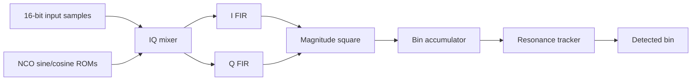
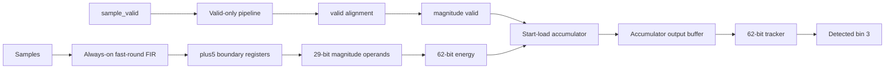
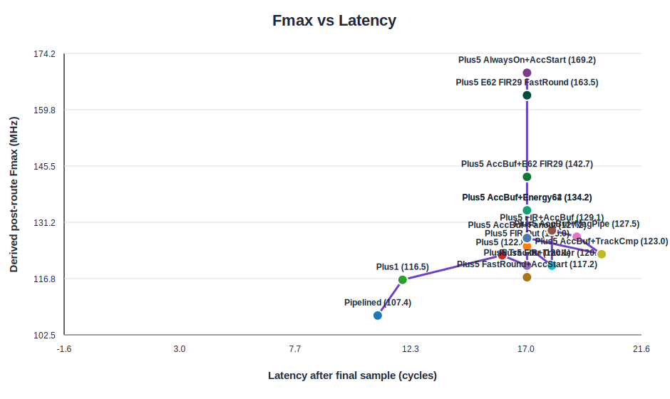
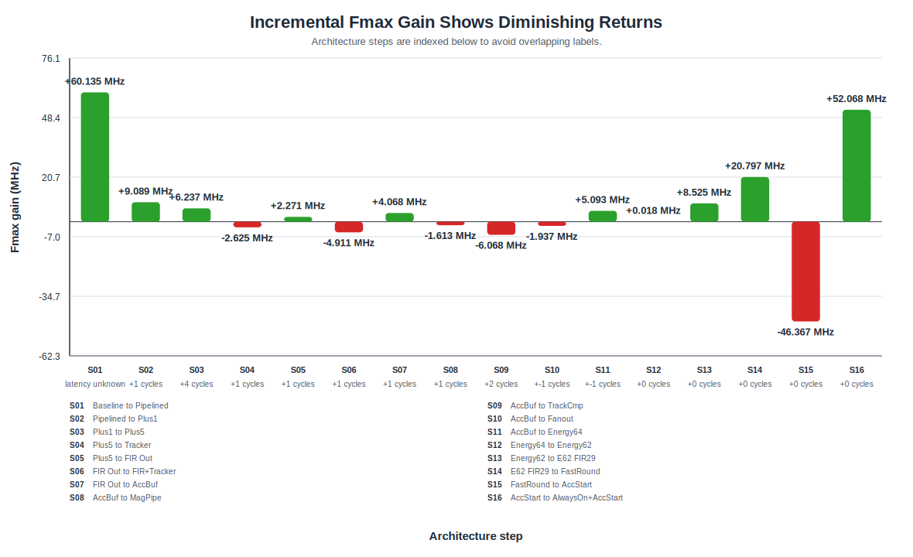
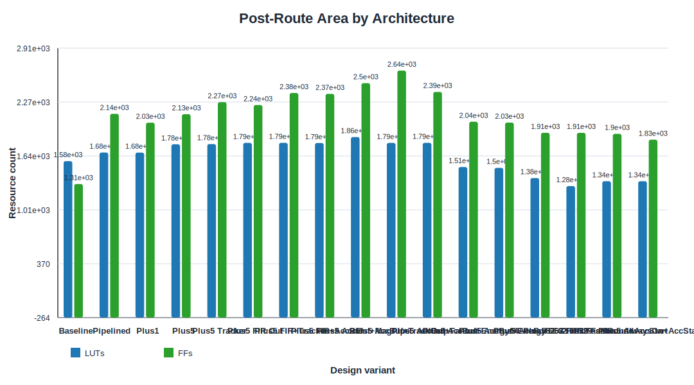
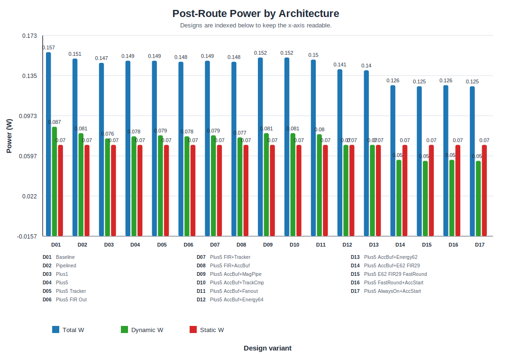

# Lock-In Resonance Tracking VLSI Project

This project implements and evaluates a fixed-point lock-in DSP accelerator for
real-time resonance tracking.

## Starting Configuration

- Input samples: 16-bit signed
- Reference sine/cosine: 16-bit signed
- Frequency bins: 8
- Samples per bin: 64
- FIR taps: 8
- Detection mode: peak detection
- Target FPGA: Artix-7 `xc7a35tcpg236-1`

## Project Layout

- `python/` - golden model, vector generation, plotting
- `vectors/` - generated ROMs, input samples, expected outputs
- `rtl/` - synthesizable SystemVerilog RTL
- `tb/` - simulation testbenches
- `vivado/` - constraints and Vivado Tcl scripts
- `reports/` - synthesis, timing, utilization, and simulation outputs
- `docs/` - report notes and project documentation

## Full Reports

The README is a compact landing page. The complete design-decision narrative,
including positive and negative branches, is maintained in:

- [`docs/pipeline_tradeoff_report.md`](docs/pipeline_tradeoff_report.md) -
  final trade-off report with timing, area, power, critical paths, and
  conclusion
- [`docs/design_insights_by_stage.md`](docs/design_insights_by_stage.md) -
  stage-by-stage explanation of what each architecture taught us
- [`docs/architecture_schematics.md`](docs/architecture_schematics.md) -
  schematic-style design evolution diagrams
- [`docs/progress_results.md`](docs/progress_results.md) - running project log
  and result history

## Current Results Snapshot

All major RTL variants were checked against the Python-generated vectors. The
expected detected resonance bin is 3 and the expected best energy is
`2926974856033640715`.

The current highest-Fmax architecture is:

```text
pipelined_plus5_firout_accbuf_energy62_fir29_fastround_alwayson_accstart
```

It is correct for the current continuous-valid vectors and reaches a derived
post-route Fmax of 169.233 MHz.

| Design | Sim | Latency | Fmax | LUTs | FFs | DSPs | Power | Critical path |
|---|---|---:|---:|---:|---:|---:|---:|---|
| Baseline | PASS | not measured | 47.299 MHz | 1579 | 1309 | 20 | 0.157 W | Control/magnitude path |
| Pipelined | PASS | 11 | 107.434 MHz | 1680 | 2136 | 20 | 0.151 W | FIR-to-magnitude |
| Plus1 | PASS | 12 | 116.523 MHz | 1679 | 2031 | 20 | 0.147 W | FIR final output |
| Plus5 | PASS | 16 | 122.760 MHz | 1777 | 2131 | 20 | 0.149 W | Accumulator/tracker |
| Plus5 FIR out accbuf | PASS | 18 | 129.099 MHz | 1792 | 2371 | 20 | 0.148 W | Magnitude DSP register |
| Energy64 | PASS | 17 | 134.192 MHz | 1509 | 2043 | 18 | 0.141 W | Narrowed magnitude DSP cascade |
| Energy62 FIR29 | PASS | 17 | 142.735 MHz | 1379 | 1912 | 10 | 0.126 W | FIR output rounding |
| FIR29 fast-round | PASS | 17 | 163.532 MHz | 1285 | 1912 | 10 | 0.125 W | Magnitude-valid accumulator control |
| Fast-round accstart | PASS | 17 | 117.165 MHz | 1342 | 1900 | 10 | 0.126 W | FIR valid/CE fanout |
| Always-on FIR + accstart | PASS | 17 | 169.233 MHz | 1342 | 1831 | 10 | 0.125 W | Magnitude-square carry chain |

Power is Vivado vectorless post-route power. Fmax is derived from the routed
100 MHz checkpoint and the reported WNS.

## Architecture Schematics

### Baseline Datapath



The baseline is functionally correct, but the direct datapath fails the
100 MHz timing target after implementation.

### Pipelined Datapath


The first major pipeline raises post-route Fmax from 47.299 MHz to
107.434 MHz while preserving the same detected bin and best energy.

### Final Selected Architecture



This final branch combines the two most recent lessons:

- Accumulator start-load removes the reset-style `running_energy` clear path.
- Always-on FIR arithmetic removes the FIR valid-to-CE fanout that made
  start-load alone a negative result.

The current bottleneck is now the narrowed magnitude-square carry chain, not
FIR fanout and not accumulator reset/control.

### Design Evolution

```text
Baseline direct datapath
  -> Fmax 47.299 MHz, timing fails at 100 MHz

Major pipelining
  -> Fmax 107.434 MHz, timing passes

Extra FIR/magnitude boundary registers
  -> Plus1 116.523 MHz, Plus5 122.760 MHz

Accumulator-output buffering
  -> Fmax 129.099 MHz

Precision and operand-width reduction
  -> Energy64 134.192 MHz
  -> Energy62 FIR29 142.735 MHz

Algebraic FIR fast-round
  -> Fmax 163.532 MHz

Accumulator start-load alone
  -> Fmax drops to 117.165 MHz because FIR valid/CE fanout dominates

Always-on FIR plus accumulator start-load
  -> Fmax 169.233 MHz, current highest-Fmax design
```

## Design Insights and Decisions

This project is not just a baseline-versus-final comparison. Each architecture
variant was chosen because the previous timing report exposed a specific
bottleneck.

Key decisions:

- Baseline RTL was kept as the correctness and timing-failure reference. It
  detects the right bin, but reaches only 47.299 MHz after route.
- The first major pipelined design became the foundation because it raised Fmax
  to 107.434 MHz and passed the 100 MHz target.
- `plus1` remains the best balanced point: it reaches 116.523 MHz with only
  one additional cycle beyond the original pipelined design.
- `plus5` showed diminishing returns. It improved Fmax, but moved the critical
  path out of FIR-to-magnitude and into accumulator/tracker logic.
- Tracker-only and tracker-compare pipelines were recorded as negative results.
  They were functionally correct, but added latency/register cost and moved the
  bottleneck back elsewhere.
- Precision reduction was the strongest architectural lever. Narrowing the
  energy datapath and then the FIR/magnitude operands reduced LUTs, FFs, DSPs,
  and power while improving Fmax.
- The FIR29 fast-round branch showed that algebraic RTL simplification can beat
  another pipeline register: it improved Fmax from 142.735 MHz to 163.532 MHz
  without adding latency.
- Accumulator start-load alone was a useful negative result. It removed the
  targeted reset-style accumulator path, but exposed a worse FIR valid/CE
  fanout path and dropped Fmax to 117.165 MHz.
- The final always-on FIR plus accumulator start-load branch fixed that fanout
  issue. It made `valid` a validity pipeline instead of a high-fanout FIR
  arithmetic enable and reached 169.233 MHz.

Final conclusion:

```text
The selected implementation is:

pipelined_plus5_firout_accbuf_energy62_fir29_fastround_alwayson_accstart

It is the current highest-Fmax architecture for the current continuous-valid
vectors. It preserves the Python golden result, keeps 17-cycle final-sample
latency, uses 10 DSPs, and reaches 169.233 MHz derived post-route Fmax.
```

The main caveat is scope: the 62-bit energy width, 29-bit FIR/magnitude width,
and always-on FIR behavior are validated for the current generated vectors. If
the input amplitude, accumulation window, FIR scaling, or `sample_valid`
stalling behavior changes, those assumptions should be revalidated.

The next measured bottleneck is the narrowed magnitude-square carry chain.
Future timing work should target that arithmetic path before returning to
accumulator iteration or control logic.

## Plots

The generated plots are committed under `reports/plots/`.

The Fmax-vs-latency plot shows every implemented variant, but only labels the
major decision points so the 17-cycle design cluster remains readable.
The area, power, and incremental-gain plots use `D##` or `S##` axis labels with
the full design/step key shown below each plot to avoid overlapping text.









## Generate Golden Vectors

The Python model uses only the standard library.

```powershell
python .\python\golden_model.py
```

Generated files include:

- `vectors/sin_rom.mem`
- `vectors/cos_rom.mem`
- `vectors/input_samples.mem`
- `vectors/phase_steps.csv`
- `vectors/expected_energy_per_bin.csv`
- `vectors/expected_detected_bin.txt`
- `vectors/expected_best_energy.txt`
- `vectors/golden_trace.csv`
- `reports/reference_energy_per_bin.svg`
- `docs/golden_model_summary.md`

## Run Baseline RTL Simulation

From the Vivado Tcl shell, run:

```tcl
cd C:/Users/CHOUDN3/Downloads/VLSI_project
vivado -mode batch -source vivado/sim_baseline.tcl
```

Expected simulation result:

```text
Expected bin: 3
Detected bin: 3
PASS
```

## Run Baseline Synthesis

```tcl
cd C:/Users/CHOUDN3/Downloads/VLSI_project
vivado -mode batch -source vivado/synth_baseline.tcl
```

The reports are written to `reports/baseline/`.

## Run Pipelined RTL Simulation

```tcl
cd C:/Users/CHOUDN3/Downloads/VLSI_project
vivado -mode batch -source vivado/sim_pipelined.tcl
```

Expected simulation result:

```text
Expected bin: 3
Detected bin: 3
PASS
```

## Run Pipelined Synthesis

```tcl
cd C:/Users/CHOUDN3/Downloads/VLSI_project
vivado -mode batch -source vivado/synth_pipelined.tcl
```

The reports are written to `reports/pipelined/`.

## Run Extra Pipeline Boundary Variants

The `plus1` and `plus5` variants add one and five extra register boundaries
between the FIR output and magnitude-square input. The `plus5_tracker` variant
keeps the five boundary registers and adds a registered tracker compare/update
split. The `plus5_firout` variant keeps the five boundary registers and adds a
registered FIR final-sum/output split. The `plus5_firout_tracker` variant
combines both FIR-output and tracker pipeline changes. The
`plus5_firout_accbuf` variant keeps the FIR-output split and adds a registered
accumulator-output buffer before the tracker. The
`plus5_firout_accbuf_magpipe` variant also decomposes the 48-bit magnitude
square into parallel 16-bit partial products. The
`plus5_firout_accbuf_trackercmp` variant keeps the accbuf design and adds a
two-stage tracker compare pipeline. The `plus5_firout_accbuf_fanout` variant
keeps accbuf and adds fanout hints on valid, enable, and tracker-control paths.
The `plus5_firout_accbuf_energy64` variant keeps accbuf but narrows the energy
datapath to 64 bits after the broad 16-to-256-bit precision sweep showed this
is exact for the current generated vectors.
The `plus5_firout_accbuf_energy62` variant uses the true 62-bit exact threshold
from that sweep.
The `plus5_firout_accbuf_energy62_fir29_fastround_accstart` variant is a
recorded negative experiment that removes the accumulator end-clear path but
exposes worse FIR valid/CE fanout.
The `plus5_firout_accbuf_energy62_fir29_fastround_alwayson_accstart` variant
removes that FIR valid/CE fanout by using an always-on fast-round FIR datapath
plus accumulator start-load, and is the current highest-Fmax datapoint for the
current continuous-valid vectors.

```tcl
cd C:/Users/CHOUDN3/Downloads/VLSI_project
vivado -mode batch -source vivado/sim_pipelined_plus1.tcl
vivado -mode batch -source vivado/synth_pipelined_plus1.tcl
vivado -mode batch -source vivado/impl_pipelined_plus1.tcl
vivado -mode batch -source vivado/sim_pipelined_plus5.tcl
vivado -mode batch -source vivado/synth_pipelined_plus5.tcl
vivado -mode batch -source vivado/impl_pipelined_plus5.tcl
vivado -mode batch -source vivado/sim_pipelined_plus5_tracker.tcl
vivado -mode batch -source vivado/synth_pipelined_plus5_tracker.tcl
vivado -mode batch -source vivado/impl_pipelined_plus5_tracker.tcl
vivado -mode batch -source vivado/sim_pipelined_plus5_firout.tcl
vivado -mode batch -source vivado/synth_pipelined_plus5_firout.tcl
vivado -mode batch -source vivado/impl_pipelined_plus5_firout.tcl
vivado -mode batch -source vivado/sim_pipelined_plus5_firout_tracker.tcl
vivado -mode batch -source vivado/synth_pipelined_plus5_firout_tracker.tcl
vivado -mode batch -source vivado/impl_pipelined_plus5_firout_tracker.tcl
vivado -mode batch -source vivado/sim_pipelined_plus5_firout_accbuf.tcl
vivado -mode batch -source vivado/synth_pipelined_plus5_firout_accbuf.tcl
vivado -mode batch -source vivado/impl_pipelined_plus5_firout_accbuf.tcl
vivado -mode batch -source vivado/sim_pipelined_plus5_firout_accbuf_magpipe.tcl
vivado -mode batch -source vivado/synth_pipelined_plus5_firout_accbuf_magpipe.tcl
vivado -mode batch -source vivado/impl_pipelined_plus5_firout_accbuf_magpipe.tcl
vivado -mode batch -source vivado/sim_pipelined_plus5_firout_accbuf_trackercmp.tcl
vivado -mode batch -source vivado/synth_pipelined_plus5_firout_accbuf_trackercmp.tcl
vivado -mode batch -source vivado/impl_pipelined_plus5_firout_accbuf_trackercmp.tcl
vivado -mode batch -source vivado/sim_pipelined_plus5_firout_accbuf_fanout.tcl
vivado -mode batch -source vivado/synth_pipelined_plus5_firout_accbuf_fanout.tcl
vivado -mode batch -source vivado/impl_pipelined_plus5_firout_accbuf_fanout.tcl
vivado -mode batch -source vivado/sim_pipelined_plus5_firout_accbuf_energy64.tcl
vivado -mode batch -source vivado/synth_pipelined_plus5_firout_accbuf_energy64.tcl
vivado -mode batch -source vivado/impl_pipelined_plus5_firout_accbuf_energy64.tcl
vivado -mode batch -source vivado/sim_pipelined_plus5_firout_accbuf_energy62.tcl
vivado -mode batch -source vivado/synth_pipelined_plus5_firout_accbuf_energy62.tcl
vivado -mode batch -source vivado/impl_pipelined_plus5_firout_accbuf_energy62.tcl
vivado -mode batch -source vivado/sim_pipelined_plus5_firout_accbuf_energy62_fir29.tcl
vivado -mode batch -source vivado/synth_pipelined_plus5_firout_accbuf_energy62_fir29.tcl
vivado -mode batch -source vivado/impl_pipelined_plus5_firout_accbuf_energy62_fir29.tcl
vivado -mode batch -source vivado/sim_pipelined_plus5_firout_accbuf_energy62_fir29_fastround.tcl
vivado -mode batch -source vivado/synth_pipelined_plus5_firout_accbuf_energy62_fir29_fastround.tcl
vivado -mode batch -source vivado/impl_pipelined_plus5_firout_accbuf_energy62_fir29_fastround.tcl
vivado -mode batch -source vivado/sim_pipelined_plus5_firout_accbuf_energy62_fir29_fastround_accstart.tcl
vivado -mode batch -source vivado/synth_pipelined_plus5_firout_accbuf_energy62_fir29_fastround_accstart.tcl
vivado -mode batch -source vivado/impl_pipelined_plus5_firout_accbuf_energy62_fir29_fastround_accstart.tcl
vivado -mode batch -source vivado/sim_pipelined_plus5_firout_accbuf_energy62_fir29_fastround_alwayson_accstart.tcl
vivado -mode batch -source vivado/synth_pipelined_plus5_firout_accbuf_energy62_fir29_fastround_alwayson_accstart.tcl
vivado -mode batch -source vivado/impl_pipelined_plus5_firout_accbuf_energy62_fir29_fastround_alwayson_accstart.tcl
```

Trade-off results are summarized in:

- `docs/pipeline_tradeoff_report.md`
- `docs/design_insights_by_stage.md`
- `reports/pipeline_tradeoff_summary.csv`

Trade-off plots are stored in `reports/plots/`:

- `pipeline_fmax_vs_latency.svg`
- `pipeline_fmax_vs_boundary_stages.svg`
- `pipeline_incremental_fmax_gain.svg`
- `pipeline_area_tradeoff.svg`
- `pipeline_power_tradeoff.svg`
- `tracker_pipeline_comparison.svg`
- `energy_precision_sweep_16_to_256.svg`
- `fir_mag_width_sweep.svg`

The current highest-Fmax recorded design is
`pipelined_plus5_firout_accbuf_energy62_fir29_fastround_alwayson_accstart`:
169.233 MHz post-route derived Fmax for the current continuous-valid vectors,
with 1342 LUTs, 1831 FFs, 10 DSPs, and 0.125 W vectorless post-route total
power. The wider Energy62 and Energy64 variants remain fallback contracts until
the 29-bit FIR/magnitude width and always-on valid assumption are validated
against broader stimuli.

The accumulator start-load follow-up is intentionally kept in the report as a
negative result: it passes simulation, but drops to 117.165 MHz post-route
derived Fmax, so it does not replace the fast-round design.

The always-on FIR plus accumulator start-load follow-up is intentionally kept
as the positive companion result: it shows that accstart became useful only
after FIR valid/CE fanout was removed. Its current bottleneck is the narrowed
magnitude-square carry chain.

## Run Post-Route Implementation

The implementation scripts use Artix-7 `xc7a35tfgg484-1` so the wide
debug-style top-level output bus has enough package I/O for place-and-route.

```tcl
cd C:/Users/CHOUDN3/Downloads/VLSI_project
vivado -mode batch -source vivado/impl_baseline.tcl
vivado -mode batch -source vivado/impl_pipelined.tcl
```

The reports are written to:

- `reports/baseline_impl/`
- `reports/pipelined_impl/`

## Run Post-Route Clock Sweep

After implementation checkpoints exist, run:

```tcl
cd C:/Users/CHOUDN3/Downloads/VLSI_project
vivado -mode batch -source vivado/sweep_post_route_timing.tcl
```

The sweep output is written to:

- `reports/clock_sweep/post_route_clock_sweep.csv`
- `reports/clock_sweep/post_route_clock_sweep_summary.txt`

This sweep is derived from the routed 100 MHz timing paths. It characterizes
the already-routed netlists without rerunning place-and-route at each clock.
