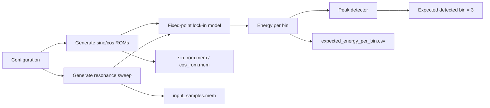
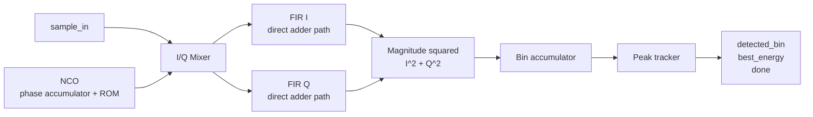
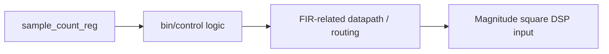
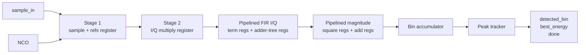
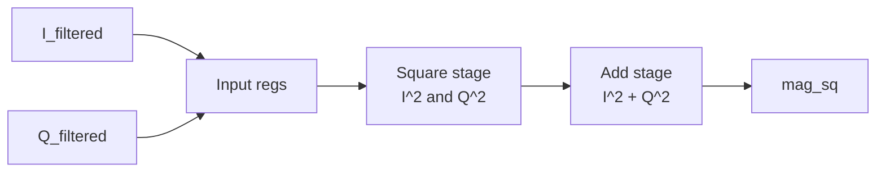
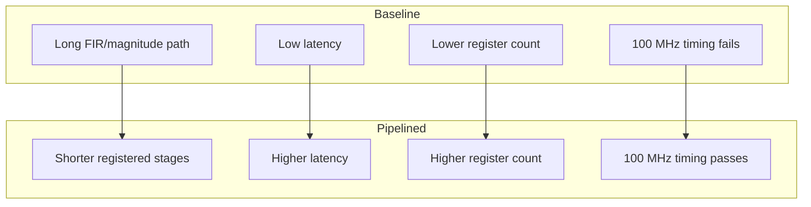
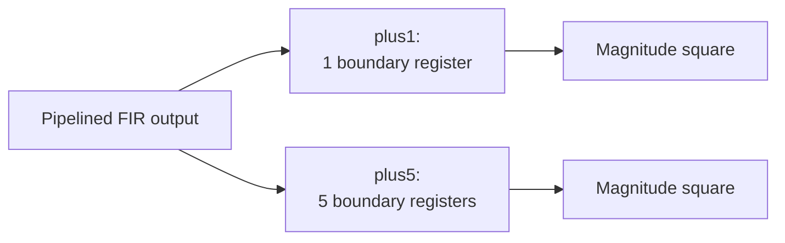
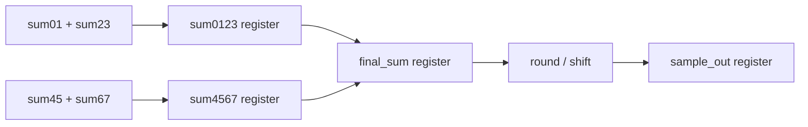
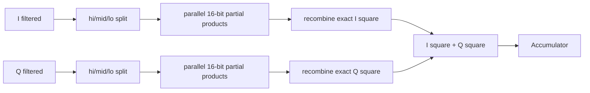

# Architecture Schematics

Last updated: May 3, 2026

This file gives visual block-level schematics for the design stages completed so
far. The goal is to make the architectural changes easy to observe as the
project moves from Python model to baseline RTL to pipelined RTL.

The companion insight log is:

```text
docs/design_insights_by_stage.md
```

## Standing Schematic Rule

After each design-decision update, this file should be updated with:

- a new or revised block diagram
- the timing/resource/power comparison affected by that design change
- the corresponding insight update in `docs/design_insights_by_stage.md`
- a clear label showing whether reported numbers are synthesis-level or
  post-implementation results

Schematics and results should evolve together so the report can show not only
what changed, but why the hardware metrics changed.

## 1. Python Golden Model

The Python model generates the test signal, ROM contents, expected energy per
bin, and expected detected resonance bin.



ASCII fallback:

```text
Config
  |--> sine/cos ROM generation --> sin_rom.mem, cos_rom.mem
  |--> resonance sweep ---------> input_samples.mem
                                  |
                                  v
                         fixed-point lock-in model
                                  |
                                  v
                          energy per frequency bin
                                  |
                                  v
                         peak detector -> bin 3
```

## 2. Baseline RTL Datapath

The baseline RTL processes one sample per cycle but keeps several heavy
operations in long combinational paths.



ASCII fallback:

```text
sample_in ----------------------+
                                v
NCO -> sin_ref/cos_ref ----> I/Q mixer
                                |
                 +--------------+--------------+
                 v                             v
          baseline FIR I                baseline FIR Q
                 |                             |
                 +-------------+---------------+
                               v
                         I^2 + Q^2
                               |
                               v
                         bin accumulator
                               |
                               v
                         peak tracker
                               |
                               v
                 detected_bin, best_energy, done
```

## 3. Baseline Critical Path

Vivado identified a long baseline timing path through control/datapath logic
into the magnitude-square stage.



Baseline timing result:

```text
Clock target:        100 MHz, 10.000 ns
WNS:                -11.343 ns
Critical path delay: 19.235 ns
Logic levels:        24
Timing met:          No
```

## 4. Pipelined RTL Datapath

The pipelined design inserts registers around the mixer, FIR, and magnitude
paths. The datapath still accepts one sample per cycle, but the output appears
after more latency.



ASCII fallback:

```text
sample_in + NCO refs
        |
        v
[Stage 1] register sample/ref/control
        |
        v
[Stage 2] I/Q multiply, registered DSP output
        |
        v
[Stage 3-6] pipelined FIR terms and adder tree
        |
        v
[Stage 7-8] pipelined I^2 + Q^2
        |
        v
bin accumulator -> peak tracker -> outputs
```

## 5. Pipelined FIR Structure

The baseline FIR used one registered output after a larger adder expression.
The pipelined FIR breaks the calculation into multiple stages.

```mermaid
flowchart LR
    X[x[n]] --> DL[Delay line]
    DL --> T[Coefficient terms<br/>1,2,3,4,4,3,2,1]
    T --> P1[Pair sums<br/>sum01 sum23 sum45 sum67]
    P1 --> P2[Group sums<br/>sum0123 sum4567]
    P2 --> P3[Final sum + shift]
    P3 --> Y[y[n]]
```

ASCII fallback:

```text
x[n], x[n-1], ... x[n-7]
        |
        v
coefficient terms:
1*x0, 2*x1, 3*x2, 4*x3, 4*x4, 3*x5, 2*x6, 1*x7
        |
        v
pair sums:   sum01, sum23, sum45, sum67
        |
        v
group sums:  sum0123, sum4567
        |
        v
final sum -> right shift -> y[n]
```

## 6. Pipelined Magnitude-Squared Structure

The magnitude block is also pipelined so squaring and final addition are not in
one long combinational stage.



ASCII fallback:

```text
I_filtered, Q_filtered
        |
        v
input registers
        |
        v
square stage: I^2 and Q^2
        |
        v
add stage: I^2 + Q^2
        |
        v
mag_sq
```

## 7. Control-Signal Delay

Because the pipelined datapath has more latency, control signals must be delayed
with the data. This keeps accumulated energy assigned to the correct bin.


ASCII fallback:

```text
sample_valid ----\
bin_id -----------> delay pipeline -> accumulator
end_of_bin ------/

Data and control must arrive together:

mag_sq_s4        -> accumulator mag_sq
bin_s4           -> accumulator bin_id
end_s4           -> accumulator end_of_bin
valid_s4         -> accumulator valid
```

## 8. Architecture Comparison



## 9. Results Comparison

### Synthesis-Level Results

| Metric | Baseline | Pipelined |
|---|---:|---:|
| Detected bin | 3 | 3 |
| Simulation result | PASS | PASS |
| WNS | -11.343 ns | 1.004 ns |
| TNS | -6961.166 ns | 0.000 ns |
| Setup failing endpoints | 868 | 0 |
| Critical path delay | 19.235 ns | 8.366 ns |
| Critical path logic levels | 24 | 16 |
| Approx. Fmax | 46.9 MHz | 111.2 MHz |
| LUTs | 1574 | 1732 |
| FFs | 860 | 1813 |
| DSPs | 20 | 20 |
| BRAM tiles | 0 | 0 |
| Total on-chip power | 0.144 W | 0.156 W |
| Dynamic power | 0.074 W | 0.086 W |
| Static power | 0.070 W | 0.070 W |

Power note:

```text
Power values are Vivado vectorless synthesized-power estimates.
Confidence level is Low for both designs.
```

### Post-Route Implementation Results

Implementation target:

```text
xc7a35tfgg484-1
```

This larger Artix-7 package was used for implementation because the current
debug-style top-level exposes a wide `best_energy[127:0]` output.

| Metric | Baseline Post-Route | Pipelined Post-Route |
|---|---:|---:|
| 100 MHz timing met | No | Yes |
| WNS | -11.142 ns | 0.692 ns |
| TNS | -7515.269 ns | 0.000 ns |
| Setup failing endpoints | 888 | 0 |
| Critical path delay | 19.320 ns | 8.778 ns |
| Critical path logic levels | 25 | 18 |
| Approx. Fmax | 47.3 MHz | 107.4 MHz |
| LUTs | 1579 | 1680 |
| FFs | 1309 | 2136 |
| DSPs | 20 | 20 |
| BRAM tiles | 0 | 0 |
| Total on-chip power | 0.157 W | 0.151 W |
| Dynamic power | 0.087 W | 0.081 W |
| Static power | 0.070 W | 0.070 W |

Power note:

```text
Post-route power is still vectorless and has Low confidence because no
SAIF/VCD switching activity file has been provided.
```

### Post-Route Clock Sweep

The clock sweep is derived from each routed 100 MHz timing checkpoint. This
characterizes the already-routed design and does not rerun implementation at
each frequency.


ASCII fallback:

```text
routed checkpoint
        |
        v
worst setup path at 100 MHz
        |
        v
minimum period = 10.000 ns - WNS
        |
        v
derived WNS at each sweep period -> PASS/FAIL
```

| Design | Derived min period | Derived Fmax | Highest passing point | First failing point |
|---|---:|---:|---:|---:|
| Baseline | 21.142 ns | 47.299 MHz | 40.000 MHz | 50.000 MHz |
| Pipelined | 9.308 ns | 107.434 MHz | 105.263 MHz | 111.111 MHz |
| Pipelined plus1 | 8.582 ns | 116.523 MHz | 111.111 MHz | 117.647 MHz |
| Pipelined plus5 | 8.146 ns | 122.760 MHz | 117.647 MHz | 125.000 MHz |
| Pipelined plus5 tracker | 8.324 ns | 120.135 MHz | 117.647 MHz | 125.000 MHz |
| Pipelined plus5 FIR out | 7.998 ns | 125.031 MHz | 125.000 MHz | 133.333 MHz |
| Pipelined plus5 FIR out tracker | 8.325 ns | 120.120 MHz | 117.647 MHz | 125.000 MHz |
| Pipelined plus5 FIR out accbuf | 7.746 ns | 129.099 MHz | 125.000 MHz | 133.333 MHz |
| Pipelined plus5 FIR out accbuf magpipe | 7.844 ns | 127.486 MHz | 125.000 MHz | 133.333 MHz |
| Pipelined plus5 FIR out accbuf trackercmp | 8.128 ns | 123.031 MHz | 117.647 MHz | 125.000 MHz |
| Pipelined plus5 FIR out accbuf fanout | 7.864 ns | 127.162 MHz | 125.000 MHz | 133.333 MHz |
| Pipelined plus5 FIR out accbuf energy64 | 7.452 ns | 134.192 MHz | 133.333 MHz | not observed in current sweep |
| Pipelined plus5 FIR out accbuf energy62 | 7.451 ns | 134.210 MHz | 133.333 MHz | not observed in current sweep |
| Pipelined plus5 FIR out accbuf energy62 FIR29 | 7.006 ns | 142.735 MHz | 133.333 MHz | not observed in current sweep |
| Pipelined plus5 FIR out accbuf energy62 FIR29 fast-round | 6.115 ns | 163.532 MHz | 133.333 MHz | not observed in current sweep |
| Pipelined plus5 FIR out accbuf energy62 FIR29 fast-round accstart | 8.535 ns | 117.165 MHz | 111.111 MHz | 117.647 MHz |
| Pipelined plus5 FIR out accbuf Energy62 FIR29 fast-round always-on accstart | 5.909 ns | 169.233 MHz | 133.333 MHz | not observed in current sweep |

```text
Design evolution impact:

Baseline long combinational path -> Fmax about 47.3 MHz
Pipelined registered datapath    -> Fmax about 107.4 MHz
Plus1 FIR/mag boundary register  -> Fmax about 116.5 MHz
Plus5 boundary register chain    -> Fmax about 122.8 MHz
Plus5 tracker pipeline           -> Fmax about 120.1 MHz
Plus5 FIR output pipeline        -> Fmax about 125.0 MHz
Plus5 FIR output + tracker       -> Fmax about 120.1 MHz
Plus5 FIR output + accbuf        -> Fmax about 129.1 MHz
Accbuf + chunked mag pipeline    -> Fmax about 127.5 MHz, DSPs reduced
Accbuf + tracker compare pipe    -> Fmax about 123.0 MHz
Accbuf + fanout hints            -> Fmax about 127.2 MHz
Accbuf + 64-bit energy datapath  -> Fmax about 134.2 MHz, area/power reduced
Accbuf + 62-bit energy datapath  -> Fmax about 134.2 MHz, marginal gain over 64-bit
FIR29 fast-round                 -> Fmax about 163.5 MHz, FIR rounding removed
Fast-round accstart              -> Fmax about 117.2 MHz, negative control rewrite
Always-on FIR + accstart         -> Fmax about 169.2 MHz, FIR valid/CE fanout removed
```

### Extra FIR-to-Magnitude Boundary Variants



ASCII fallback:

```text
plus1:
FIR output -> boundary register x1 -> magnitude-square input

plus5:
FIR output -> boundary register x5 -> magnitude-square input

plus5 tracker:
FIR output -> boundary register x5 -> magnitude-square input
           -> accumulator -> tracker compare register -> tracker update register

plus5 FIR out:
partial FIR sums -> final_sum register -> round/shift output
                 -> boundary register x5 -> magnitude-square input

plus5 FIR out accbuf:
partial FIR sums -> final_sum register -> round/shift output
                 -> boundary register x5 -> magnitude-square input
                 -> accumulator -> accumulator output register -> tracker

plus5 FIR out accbuf magpipe:
partial FIR sums -> final_sum register -> round/shift output
                 -> boundary register x5 -> chunked magnitude-square pipeline
                 -> accumulator -> accumulator output register -> tracker

plus5 FIR out accbuf trackercmp:
partial FIR sums -> final_sum register -> round/shift output
                 -> boundary register x5 -> magnitude-square input
                 -> accumulator -> accumulator output register
                 -> tracker candidate register -> tracker compare/update register

plus5 FIR out accbuf fanout:
partial FIR sums -> fanout-hint FIR output path -> boundary register x5
                 -> fanout-hint magnitude-square input
                 -> accumulator -> accumulator output register
                 -> fanout-hint tracker update

plus5 FIR out accbuf energy64:
partial FIR sums -> final_sum register -> round/shift output
                 -> boundary register x5 -> 64-bit narrowed magnitude energy
                 -> 64-bit accumulator -> accumulator output register
                 -> 64-bit tracker

plus5 FIR out accbuf energy62:
partial FIR sums -> final_sum register -> round/shift output
                 -> boundary register x5 -> 62-bit narrowed magnitude energy
                 -> 62-bit accumulator -> accumulator output register
                 -> 62-bit tracker

plus5 FIR out accbuf energy62 FIR29:
partial FIR sums -> final_sum register -> 29-bit round/shift output
                 -> boundary register x5 -> 29-bit magnitude operands
                 -> exact 62-bit energy -> 62-bit accumulator/output buffer
                 -> 62-bit tracker

plus5 FIR out accbuf energy62 FIR29 fast-round:
partial FIR sums -> final_sum register -> sign-biased 29-bit round/shift
                 -> boundary register x5 -> 29-bit magnitude operands
                 -> exact 62-bit energy -> 62-bit accumulator/output buffer
                 -> 62-bit tracker

plus5 FIR out accbuf energy62 FIR29 fast-round accstart:
partial FIR sums -> sign-biased 29-bit round/shift -> boundary register x5
                 -> 29-bit magnitude operands -> exact 62-bit energy
                 -> accumulator start-load instead of end-clear
                 -> output buffer -> 62-bit tracker

plus5 FIR out accbuf energy62 FIR29 fast-round always-on accstart:
always-on sign-biased FIR datapath -> valid-only pipeline -> boundary register x5
                 -> 29-bit magnitude operands -> exact 62-bit energy
                 -> accumulator start-load instead of end-clear
                 -> output buffer -> 62-bit tracker
```

Post-route critical-path movement:

| Design | Critical path location |
|---|---|
| Pipelined | FIR output into magnitude-square DSP input |
| Pipelined plus1 | FIR internal final output register path |
| Pipelined plus5 | Accumulator to tracker |
| Pipelined plus5 tracker | FIR final output path |
| Pipelined plus5 FIR out | Accumulator to tracker |
| Pipelined plus5 FIR out tracker | Magnitude valid to accumulator reset |
| Pipelined plus5 FIR out accbuf | Magnitude DSP register |
| Pipelined plus5 FIR out accbuf magpipe | Accumulator output buffer to tracker CE |
| Pipelined plus5 FIR out accbuf trackercmp | FIR final output path |
| Pipelined plus5 FIR out accbuf fanout | Magnitude DSP register |
| Pipelined plus5 FIR out accbuf energy64 | Narrowed magnitude DSP cascade |
| Pipelined plus5 FIR out accbuf energy62 | Narrowed magnitude DSP cascade |
| Pipelined plus5 FIR out accbuf energy62 FIR29 | FIR output rounding |
| Pipelined plus5 FIR out accbuf energy62 FIR29 fast-round | Magnitude-valid to accumulator reset routing |
| Pipelined plus5 FIR out accbuf energy62 FIR29 fast-round accstart | FIR valid to FIR partial-sum CE fanout |
| Pipelined plus5 FIR out accbuf Energy62 FIR29 fast-round always-on accstart | Magnitude-square carry chain |

Interpretation:

```text
The plus5 variant moved the bottleneck out of the FIR-to-magnitude boundary.
Later stages show why the target must follow the measured critical path: after
fast-round the bottleneck became accumulator reset/control, after accstart it
became FIR valid/CE fanout, and after always-on FIR plus accstart it moved into
the magnitude-square carry chain.
```

### Tracker Pipeline Variant


ASCII fallback:

```text
magnitude -> accumulator -> compare_valid/update_best register
                         -> best_energy/detected_bin update register
```

Post-route result:

```text
plus5 tracker:
Fmax 120.135 MHz, latency 17 cycles
critical path: FIR final sum/output register
```

Interpretation:

```text
The tracker pipeline confirms that the plus5 accumulator/tracker bottleneck was
real, but it is not the best optimization lever by itself. Once the tracker
decision is split, the dominant path moves back to the FIR final output logic,
and the design becomes slightly slower than plain plus5.
```

### FIR Output Pipeline Variant



ASCII fallback:

```text
before:
sum0123 + sum4567 -> round/shift -> sample_out

after:
sum0123 + sum4567 -> final_sum register -> round/shift -> sample_out
```

Post-route result:

```text
plus5 FIR out:
Fmax 125.031 MHz, latency 17 cycles
critical path: accumulator to tracker
```

Interpretation:

```text
This variant directly targets the FIR final output path exposed by the
plus5_tracker experiment. It improves Fmax and reaches the 125 MHz sweep point,
but the bottleneck returns to accumulator/tracker. The follow-on combined
experiment showed that the current tracker split is not the right companion
fix.
```

### Combined FIR Output And Tracker Variant


ASCII fallback:

```text
FIR final_sum reg -> boundary x5 -> magnitude -> accumulator
                                      |
                                      v
                         tracker compare reg -> tracker update reg
```

Post-route result:

```text
plus5 FIR out tracker:
Fmax 120.120 MHz, latency 18 cycles
critical path: magnitude valid/control to accumulator reset
```

Interpretation:

```text
Combining the current tracker pipeline with the FIR-output split is not
beneficial. The design remains correct, but route delay on a control/reset path
dominates and Fmax falls below plus5 FIR out.
```

### Accumulator Output Buffer Variant


ASCII fallback:

```text
FIR final_sum reg -> boundary x5 -> magnitude -> accumulator
                                      |
                                      v
                       accumulator output reg -> tracker
```

Post-route result:

```text
plus5 FIR out accbuf:
Fmax 129.099 MHz, latency 18 cycles
critical path: magnitude DSP register
near-critical path: accumulator output buffer to tracker CE
```

Interpretation:

```text
This design was the highest-Fmax variant before the energy64 precision change.
It avoids the negative
control/reset behavior seen in the combined tracker-pipeline experiment and
instead places a clean register boundary between accumulator outputs and the
tracker. The top setup path moves into the magnitude DSP register stage, while
accumulator-to-tracker remains a near-critical follow-up path.
```

### Chunked Magnitude Pipeline Variant



ASCII fallback:

```text
48-bit I/Q
   -> split into 16-bit hi/mid/lo chunks
   -> parallel partial products
   -> recombine exact I^2 and Q^2
   -> accumulator -> accumulator output reg -> tracker
```

Post-route result:

```text
plus5 FIR out accbuf magpipe:
Fmax 127.486 MHz, latency 19 cycles, DSPs 14
critical path: accumulator output buffer to tracker CE
```

Interpretation:

```text
This experiment answers the parallelization question. Parallelizing the square
reduces DSP usage from 20 to 14 and removes the magnitude DSP-register path as
the top bottleneck, but the design is slower than accbuf because the
accumulator-output-buffer to tracker CE path dominates again.
```

### Tracker Compare Pipeline After Accbuf


ASCII fallback:

```text
FIR final_sum reg -> boundary x5 -> magnitude -> accumulator
                                      |
                                      v
                       accumulator output reg -> tracker candidate reg
                                                -> tracker compare/update reg
```

Post-route result:

```text
plus5 FIR out accbuf trackercmp:
Fmax 123.031 MHz, latency 20 cycles
critical path: FIR final output register path
```

Interpretation:

```text
This is a negative speed result. The tracker compare split is functionally
correct, but adds two cycles and substantial FF count while dropping Fmax below
the accbuf parent. The visual takeaway is that the bottleneck moves backward
into FIR final-output logic after tracker-side staging.
```

### Fanout-Hint Variant After Accbuf


ASCII fallback:

```text
FIR fanout-hint path -> boundary x5 -> magnitude fanout-hint path
                                      -> accumulator output reg
                                      -> tracker fanout-hint update
```

Post-route result:

```text
plus5 FIR out accbuf fanout:
Fmax 127.162 MHz, latency 17 cycles
critical path: magnitude DSP register
```

Interpretation:

```text
The fanout hints successfully reduce several valid/FIR control nets, but do
not improve the final routed Fmax. The design remains dominated by the
magnitude DSP path, and the tracker update/CE fanout remains high.
```

### Energy64 Precision-Aware Variant After Accbuf


ASCII fallback:

```text
FIR final_sum reg -> boundary x5 -> narrowed 64-bit magnitude energy
                                      -> 64-bit accumulator output reg
                                      -> 64-bit tracker
```

Post-route result:

```text
plus5 FIR out accbuf energy64:
Fmax 134.192 MHz, latency 17 cycles, DSPs 18
critical path: narrowed magnitude DSP cascade
```

Interpretation:

```text
This was the highest-Fmax precision-aware architecture before the Energy62
exact-threshold follow-up. Instead of adding another local register or hint, it
changes the datapath contract after the Python precision sweep showed that the
current vectors need only 62 energy bits. Narrowing to 64 bits preserves the
exact detected bin and best energy for this stimulus set while reducing area,
power, DSP count, and the width of accumulator/tracker state.
```

### Energy62 Exact-Threshold Variant After Accbuf


ASCII fallback:

```text
FIR final_sum reg -> boundary x5 -> narrowed 62-bit magnitude energy
                                      -> 62-bit accumulator output reg
                                      -> 62-bit tracker
```

Post-route result:

```text
plus5 FIR out accbuf energy62:
Fmax 134.210 MHz, latency 17 cycles, DSPs 18
critical path: narrowed magnitude DSP cascade
```

Interpretation:

```text
This tests the true exact threshold from the precision sweep. It is slightly
smaller and slightly faster than Energy64, but the critical path does not move.
The visual takeaway is that exact-threshold narrowing is measurable, but the
large architectural win already came from moving away from the original 128-bit
energy datapath.
```

### Energy62 FIR29 Operand-Width Variant After Accbuf


ASCII fallback:

```text
FIR final_sum reg -> 29-bit round/shift output -> boundary x5
                  -> 29-bit magnitude operands -> exact 62-bit energy
                  -> 62-bit accumulator output reg -> 62-bit tracker
```

Post-route result:

```text
plus5 FIR out accbuf energy62 FIR29:
Fmax 142.735 MHz, latency 17 cycles, DSPs 10
critical path: FIR final_sum-to-sample_out round/shift path
```

Interpretation:

```text
This is the first follow-up that removes the Energy62 magnitude-DSP bottleneck.
The Python FIR/magnitude width sweep found that 29 signed FIR I/Q bits preserve
the exact current-vector energies. Reducing from 48 to 29 signed bits cuts
eight DSPs and moves the worst setup path back into FIR output rounding.
```

### Energy62 FIR29 Fast-Round Variant

```mermaid
flowchart LR
    FIRSUM[FIR final_sum register] --> FR[Sign-biased fast round/shift]
    FR --> BND29[plus5 boundary registers]
    BND29 --> MAG29[29-bit magnitude operands]
    MAG29 --> E62[62-bit exact energy]
    E62 --> ACC29[62-bit accumulator]
    ACC29 --> ABUF29[62-bit accumulator output buffer]
    ABUF29 --> TRK29[62-bit tracker]
```

ASCII fallback:

```text
FIR final_sum reg -> sign-biased 29-bit round/shift -> boundary x5
                  -> 29-bit magnitude operands -> exact 62-bit energy
                  -> 62-bit accumulator output reg -> 62-bit tracker
```

Post-route result:

```text
plus5 FIR out accbuf energy62 FIR29 fast-round:
Fmax 163.532 MHz, latency 17 cycles, DSPs 10
critical path: magnitude valid to accumulator reset routing
```

Interpretation:

```text
This removes the FIR output rounding bottleneck without adding latency. The
visual change is small, but the implementation effect is large: the
round/shift path loses the expensive negate/add/negate shape, and the top path
moves to route-dominated accumulator control.
```

### Accumulator Start-Load Variant

```mermaid
flowchart LR
    FR[Fast-round FIR output] --> BND[plus5 boundary registers]
    BND --> MAG[29-bit magnitude square]
    MAG --> ENERGY[62-bit mag_sq]
    START[start_of_bin pipe] --> ACC[Accumulator start-load mux]
    END[end_of_bin pipe] --> DONE[bin_done and bin_energy]
    ENERGY --> ACC
    ACC --> BUF[Accumulator output buffer]
    BUF --> TRK[62-bit tracker]

    classDef change fill:#fff4d6,stroke:#a6761d,stroke-width:2px;
    class START,ACC change;
```

```text
plus5 FIR out accbuf energy62 FIR29 fast-round accstart:
Fmax 117.165 MHz, latency 17 cycles, DSPs 10
critical path: FIR valid_p1 to FIR partial-sum CE fanout
```

Interpretation:

```text
This control rewrite removes the accumulator end-of-bin synchronous-clear
structure from the top setup path. Instead of clearing running_energy after a
bin, the first sample of the next bin overwrites it with mag_sq. The experiment
is functionally correct, but slower after route: the design exposes a large
FIR valid/CE fanout path, so this is a recorded negative branch.
```

### Always-On FIR Plus Accumulator Start-Load Variant

```mermaid
flowchart LR
    IN[sample_in] --> FIRAO[Always-on fast-round FIR datapath]
    VALID[sample_valid] --> VPIPE[Valid-only pipeline]
    FIRAO --> BND[plus5 boundary registers]
    VPIPE --> BNDV[boundary valid pipe]
    BND --> MAG[29-bit magnitude square]
    BNDV --> MAGV[magnitude valid pipe]
    MAG --> ENERGY[62-bit mag_sq]
    MAGV --> ACC[Accumulator start-load]
    START[start_of_bin pipe] --> ACC
    END[end_of_bin pipe] --> ACC
    ENERGY --> ACC
    ACC --> BUF[Accumulator output buffer]
    BUF --> TRK[62-bit tracker]

    classDef change fill:#efe6ff,stroke:#7f3c8d,stroke-width:2px;
    class FIRAO,VPIPE,ACC change;
```

ASCII fallback:

```text
sample stream -> always-on fast-round FIR arithmetic
sample_valid  -> valid-only pipeline, no FIR arithmetic CE fanout
FIR output    -> plus5 boundary -> 29-bit magnitude -> 62-bit energy
energy        -> accumulator start-load/output buffer -> 62-bit tracker
```

Post-route result:

```text
plus5 FIR out accbuf energy62 FIR29 fast-round always-on accstart:
Fmax 169.233 MHz, latency 17 cycles, DSPs 10
critical path: magnitude-square carry chain
```

Interpretation:

```text
This visually shows the important design change: valid no longer gates the FIR
arithmetic registers. That removes the fanout path exposed by the negative
accstart experiment. With that fanout cleaned up, accumulator start-load is no
longer the top problem and the limiting path moves into magnitude arithmetic.
```

### Trade-Off Plots

Stored plot files:

- `reports/plots/pipeline_fmax_vs_latency.svg`
- `reports/plots/pipeline_fmax_vs_boundary_stages.svg`
- `reports/plots/pipeline_incremental_fmax_gain.svg`
- `reports/plots/pipeline_area_tradeoff.svg`
- `reports/plots/pipeline_power_tradeoff.svg`
- `reports/plots/tracker_pipeline_comparison.svg`
- `reports/plots/energy_precision_sweep_16_to_256.svg`
- `reports/plots/fir_mag_width_sweep.svg`

The most important plot for the current decision is:

```text
reports/plots/pipeline_incremental_fmax_gain.svg
```

It shows that the original pipelining step gives the largest gain, `plus1`
still gives a useful gain, and `plus5` gives a smaller incremental gain for
four additional latency cycles.

## 10. Visual Design Evolution

```text
Phase 1: Python reference

samples + ROMs -> software lock-in model -> expected bin 3


Phase 2: Baseline RTL

samples + ROMs -> hardware lock-in datapath -> correct bin 3
                                      |
                                      v
                              timing fails at 100 MHz


Phase 3: Pipelined RTL

samples + ROMs -> registered hardware stages -> correct bin 3
                                      |
                                      v
                              timing passes at 100 MHz


Phase 4: Extra FIR-to-magnitude boundary registers

plus1: FIR -> register x1 -> magnitude -> Fmax 116.5 MHz, latency 12 cycles
plus5: FIR -> register x5 -> magnitude -> Fmax 122.8 MHz, latency 16 cycles
                                      |
                                      v
                     diminishing returns; bottleneck moves downstream


Phase 5: Tracker pipeline after plus5

plus5 tracker: accumulator -> tracker compare reg -> tracker update reg
                                      |
                                      v
              correct, but Fmax drops to 120.1 MHz and FIR output dominates


Phase 6: FIR output pipeline after plus5

plus5 FIR out: FIR final_sum reg -> round/shift -> output
                                      |
                                      v
              Fmax rises to 125.0 MHz; accumulator/tracker dominates again


Phase 7: FIR output plus tracker pipeline

plus5 FIR out tracker: FIR output split + tracker split
                                      |
                                      v
              correct, but Fmax drops to 120.1 MHz; control routing dominates


Phase 8: FIR output plus accumulator-output buffer

plus5 FIR out accbuf: accumulator -> output buffer -> tracker
                                      |
                                      v
              Fmax rises to 129.1 MHz; magnitude DSP register now dominates


Phase 9: Chunked magnitude-square parallelization

plus5 FIR out accbuf magpipe: 48-bit square -> parallel 16-bit partial products
                                      |
                                      v
              DSPs fall to 14, but Fmax drops to 127.5 MHz; tracker CE dominates


Phase 10: Tracker compare pipeline after accbuf

plus5 FIR out accbuf trackercmp: accumulator output reg -> tracker compare pipe
                                      |
                                      v
              correct, but Fmax drops to 123.0 MHz; FIR final output dominates


Phase 11: Fanout hints after accbuf

plus5 FIR out accbuf fanout: valid/FIR controls replicated by fanout hints
                                      |
                                      v
              fanout improves, but Fmax drops to 127.2 MHz; magnitude dominates


Phase 12: Precision-aware energy narrowing

plus5 FIR out accbuf energy64: 128-bit energy path -> 64-bit energy path
                                      |
                                      v
              Fmax rises to 134.2 MHz; LUTs, FFs, DSPs, and power all drop


Phase 13: Exact-threshold energy narrowing

plus5 FIR out accbuf energy62: 64-bit energy path -> 62-bit energy path
                                      |
                                      v
              Fmax rises slightly to 134.210 MHz; small area/power reduction


Phase 14: Exact FIR/magnitude operand narrowing

plus5 FIR out accbuf energy62 FIR29: 48-bit FIR/mag operands -> 29-bit operands
                                      |
                                      v
              Fmax rises to 142.735 MHz; DSPs drop to 10; FIR output now limits


Phase 15: FIR output fast-round simplification

plus5 FIR out accbuf energy62 FIR29 fast-round: sign-aware round -> sign-biased shift
                                      |
                                      v
              Fmax rises to 163.532 MHz; FIR rounding no longer limits


Phase 16: Accumulator start-load reset removal

plus5 FIR out accbuf energy62 FIR29 fast-round accstart: end-clear -> start-load
                                      |
                                      v
              Fmax drops to 117.165 MHz; FIR valid/CE fanout dominates


Phase 17: Always-on FIR datapath plus accumulator start-load

plus5 FIR out accbuf energy62 FIR29 fast-round always-on accstart:
FIR arithmetic CEs removed; valid becomes validity-only pipeline
                                      |
                                      v
              Fmax rises to 169.233 MHz; magnitude-square carry chain dominates
```
